# 注册步骤

## 入驻淘宝联盟

### 登录、注册淘宝联盟

* 登录淘宝联盟生态伙伴->进入后台
    
    * [淘宝联盟生态链接](https://pub.alimama.com/)
    * （初次登陆可能需要补全认证信息）

### 媒体备案

* 点击```我要推广```-> ```媒体备案管理```->```新增媒体备案```

    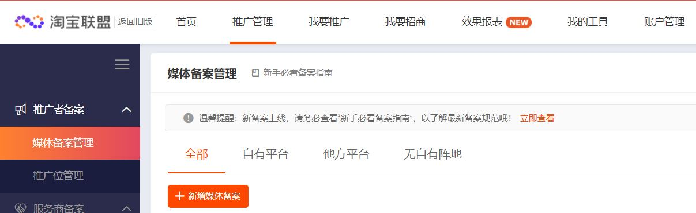

* 备案类型；```他方平台```->```社交平台```->```下一步```

    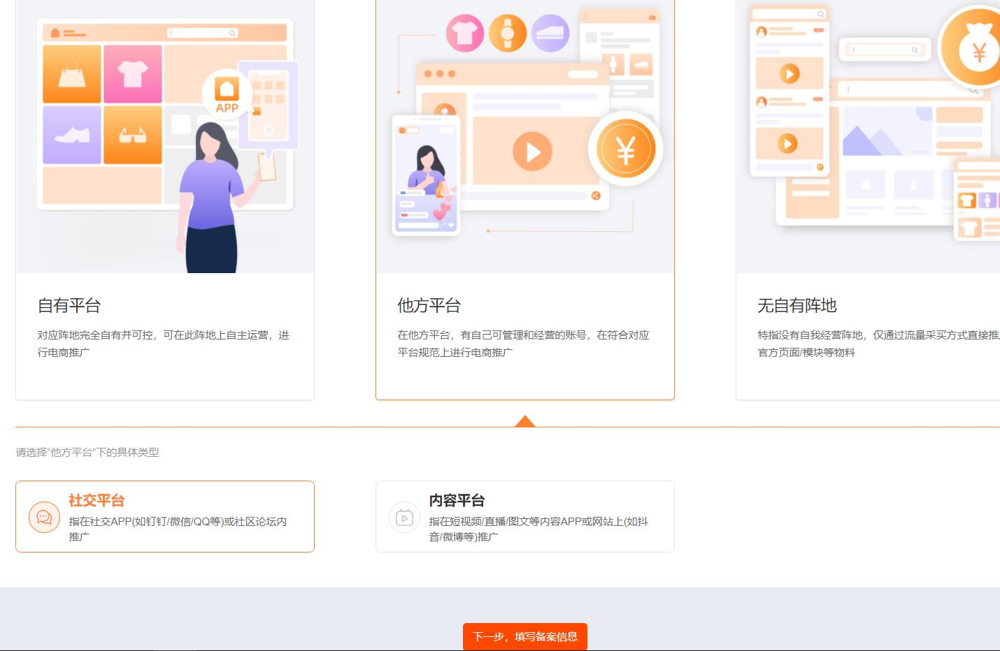

* 按实际社交平台填写，成功后备案管理表中就会显示刚备案的一条记录

    

### 添加推广位

* 添加推广位 ```我要推广```-> ```推广位管理```->```新增推广位```->选择上一步备案的平台，名称随意填写->```下一步```

    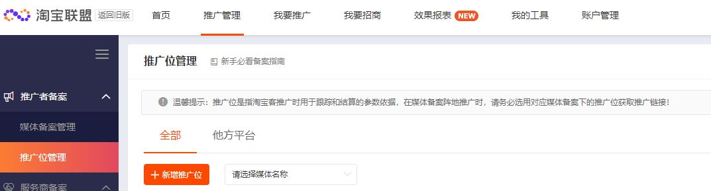

* 推广位添加成功后，推广位管理表就会显示刚添加的推广位，记下pid（mm_xxx_xxx_xxx）

### 申请appkey

* 回到备案管理一览表，鼠标移动到已备案的记录上，点击```APPKEY申请```，弹出对话框，点击```立即申请```，跳转到淘宝联盟开发平台

    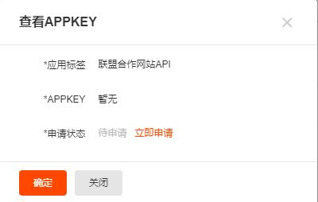

* 创建应用： ```应用管理```->```创建第一个应用```->```联盟开放```->```创建```

    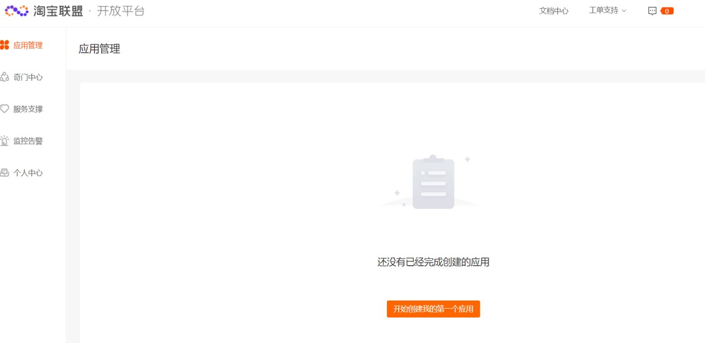
    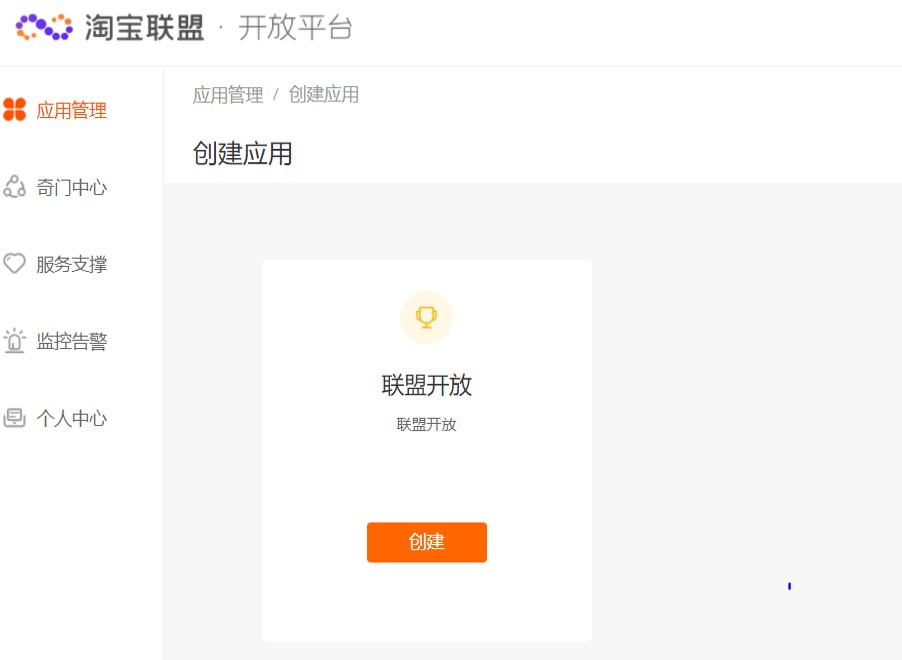

* 一级类目```联盟合作```
* 二级类目```全部```
* 第一次可能需要申请，点击```申请资质```，等待审核

    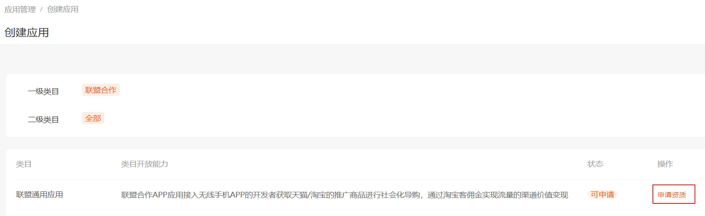
    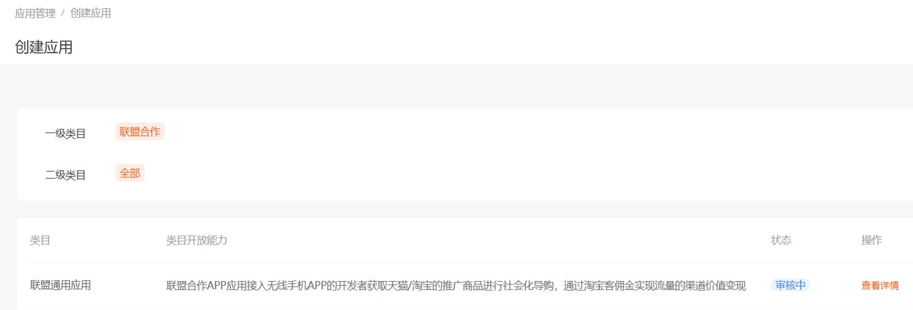

* 申请成功后，点击```创建应用```，填写内容后点击```提交```

    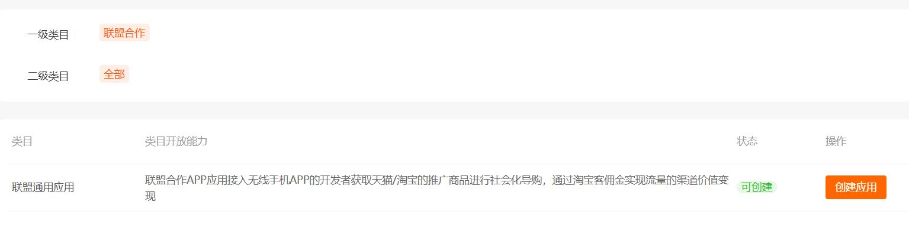
    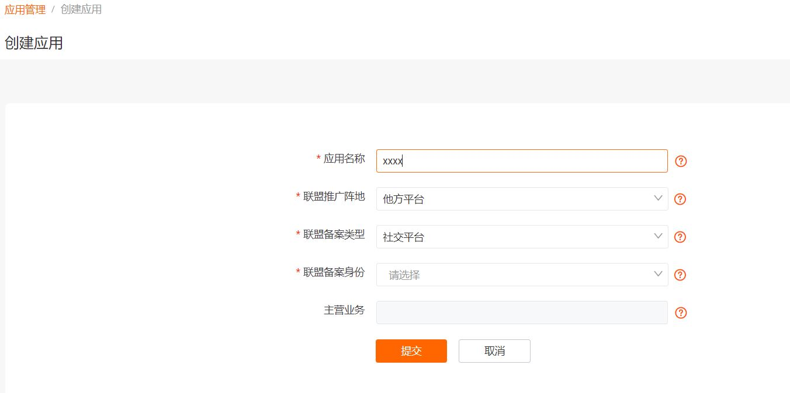

* 创建成功后，就可以看到创建的应用了,记下应用的Appkey和AppSecret

    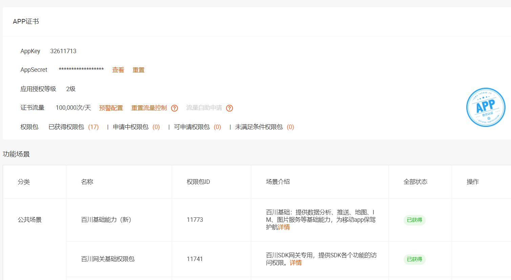

* 申请所有可申请的权限包，点击```可申请```，理由随便写够100字即可，之后刷新等待申请成功

    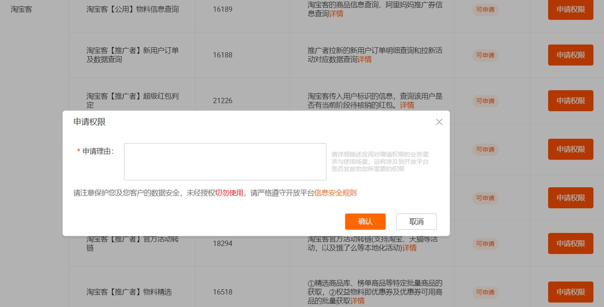

### 验证api是否可用

* 查看[服务端api文档](https://aff-open.taobao.com/#!/document)
* 登录[api测试工具](https://open.taobao.com/docV3.htm?docId=1&docType=15)
* 选择一个api进行测试

    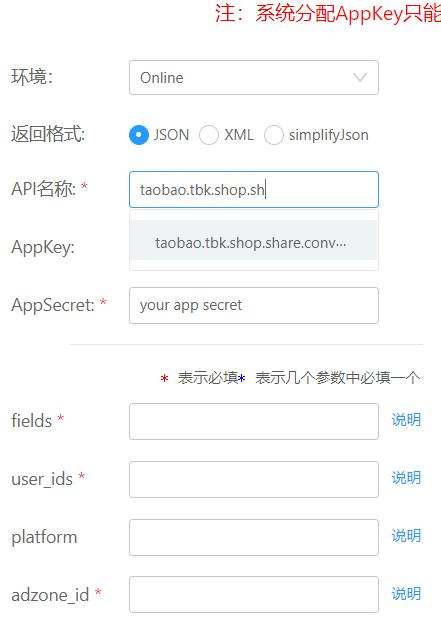

